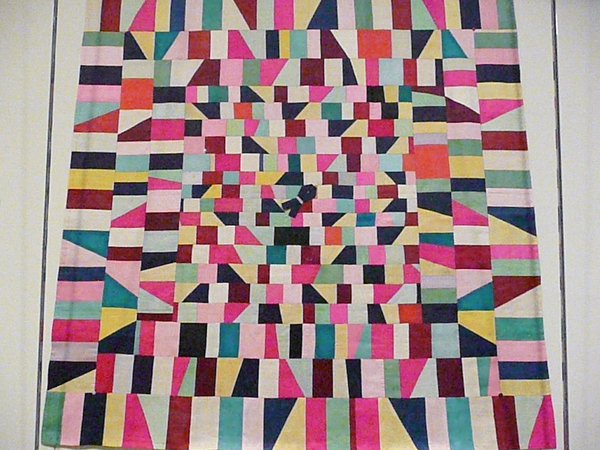
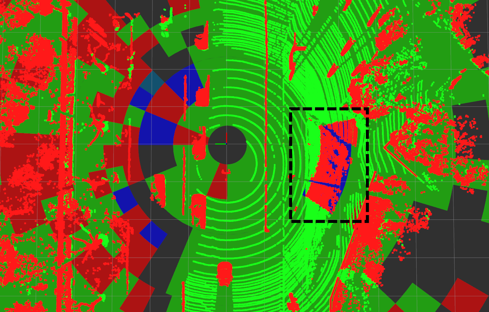

<div align="center">
    <h1>Patchwork</h1>
    <a href="https://github.com/LimHyungTae/patchwork"></a>
    <a href="https://github.com/LimHyungTae/patchwork"></a>
    <a href="https://github.com/LimHyungTae/patchwork"></a>
    <a href="https://ieeexplore.ieee.org/document/9466396">
    <br />
    <br />
    <a href=https://youtu.be/rclqeDi4gow>Video</a>
    <span>&nbsp;&nbsp;•&nbsp;&nbsp;</span>
    <a href="https://github.com/LimHyungTae/patchwork?tab=readme-ov-file#requirements">Install by ROS</a>
    <span>&nbsp;&nbsp;•&nbsp;&nbsp;</span>
    <a href=https://arxiv.org/abs/2108.05560>Paper</a>
    <span>&nbsp;&nbsp;•&nbsp;&nbsp;</span>
    <a href=https://github.com/LimHyungTae/patchwork/wiki>Project Wiki (for beginners)</a>
  <br />
  <br />
  <div style="display: flex; justify-content: space-between; width: 100%;">
      
      
  </div>
  <br />
  Official page of "Patchwork: Concentric Zone-based Region-wise Ground Segmentation <br />
  with Ground Likelihood Estimation Using a 3D LiDAR Sensor", <br />
  which is accepted by RA-L with IROS'21 option.
</div>

---

**IMPORTANT**: (Aug. 18th, 2024) I employ TBB, so its FPS is increased from **50 Hz** to **100 Hz**! 
If you want to use the paper version of Patchwork for SOTA comparison purpose, Please use this [ground seg. benchmark code](https://github.com/url-kaist/Ground-Segmentation-Benchmark).


Patchwork                  |  Concept of our method (CZM & GLE)
:-------------------------:|:-------------------------:
 |  

It's an overall updated version of **R-GPF of ERASOR** [**[Code](https://github.com/LimHyungTae/ERASOR)**] [**[Paper](https://arxiv.org/abs/2103.04316)**]. 

---


### Characteristics

As shown in the demo videos, our method shows the most promising robust performance compared with other state-of-the-art methods, especially, our method focuses on the little perturbation of precision/recall as shown in [this figure](img/seq_00_pr_zoom.pdf).

Please kindly note that the concept of *traversable area* and *ground* is quite different! Please refer to our paper.

---

## Contents
0. [Test Env.](#Test-Env.)
0. [Requirements](#requirements)
0. [How to Run Patchwork](#How-to-Run-Patchwork)
0. [Citation](#citation)

### Test Env.

The code is tested successfully at
* Linux 20.04 LTS
* ROS Noetic

## Requirements

### ROS Setting
- 1. Install [ROS](http://torch.ch/docs/getting-started.html) on a machine. 
- 2. Thereafter, [jsk-visualization](https://github.com/jsk-ros-pkg/jsk_visualization) is required to visualize Ground Likelihood Estimation status.

```bash
(if you use ubuntu 20.04)
sudo apt-get install ros-noetic-jsk-recognition
sudo apt-get install ros-noetic-jsk-common-msgs
sudo apt-get install ros-noetic-jsk-rviz-plugins
(if you use ubuntu 18.04)
sudo apt-get install ros-melodic-jsk-recognition
sudo apt-get install ros-melodic-jsk-common-msgs
sudo apt-get install ros-melodic-jsk-rviz-plugins
```

- 3. Compile compile this package. We use [catkin tools](https://catkin-tools.readthedocs.io/en/latest/),
```bash
mkdir -p ~/catkin_ws/src
cd ~/catkin_ws/src
git clone https://github.com/LimHyungTae/patchwork.git
cd .. && catkin build patchwork 
```

## How to Run Patchwork

We provide four examples:

* How to run Patchwork in SemanticKITTI dataset
    * Offline KITTI dataset
    * Online (ROS Callback) KITTI dataset

* How to run Patchwork in your own dataset
    * Offline by loading pcd files
    * Online (ROS Callback) using your ROS bag file

### Offline KITTI dataset

1. Download [SemanticKITTI](http://www.semantic-kitti.org/dataset.html#download) Odometry dataset (We also need labels since we also open the evaluation code! :)

2. Set the `data_path` in `launch/offline_kitti.launch` for your machine.

The `data_path` consists of `velodyne` folder and `labels` folder as follows:

```
data_path (e.g. 00, 01, ..., or 10)
_____velodyne
     |___000000.bin
     |___000001.bin
     |___000002.bin
     |...
_____labels
     |___000000.label
     |___000001.label
     |___000002.label
     |...
_____...
   
```

3. Run launch file 
```
roslaunch patchwork offline_kitti.launch
```

You can directly feel the speed of Patchwork! :wink:

### Online (ROS Callback) KITTI dataset

We also provide rosbag example. If you run our patchwork via rosbag, please refer to this example.

1. After building this package, run the roslaunch as follows:

```
roslaunch patchwork run_patchwork.launch is_kitti:=true
```

Then you can see the below message:


2. Set the `data_path` in `launch/kitti_publisher.launch` for your machine, which is same with the aforementioned parameter in "Offline KITTI dataset" part. 

3. Then, run ros player (please refer to `nodes/ros_kitti_publisher.cpp`) by following command at another terminal window:
 
```
roslaunch patchwork kitti_publisher.launch
```


### Own dataset using pcd files

Please refer to `/nodes/offilne_own_data.cpp`. 

(Note that in your own data format, there may not exist ground truth labels!)

Be sure to set right params. Otherwise, your results may be wrong as follows:

W/ wrong params            | After setting right params
:-------------------------:|:-------------------------:
 |  

For better understanding of the parameters of Patchwork, please read [our wiki, 4. IMPORTANT: Setting Parameters of Patchwork in Your Own Env.](https://github.com/LimHyungTae/patchwork/wiki/4.-IMPORTANT:-Setting-Parameters-of-Patchwork-in-Your-Own-Env.).


#### Offline (Using *.pcd or *.bin file)

1. Utilize `/nodes/offilne_own_data.cpp`

2. Please check the output by following command and corresponding files:

3. Set appropriate absolute file directory, i.e. `file_dir`, in `offline_ouster128.launch` 
```
roslaunch patchwork offline_ouster128.launch
```

#### Online (via your ROS bag file)

It is easy by re-using `run_patchwork.launch`.

1. Remap the topic of subscriber, i.g. modify remap line as follows:

```
<remap from="/patchwork/cloud" to="$YOUR_LIDAR_TOPIC_NAME$"/>
```

Note that the type subscribed data is `sensor_msgs::PointCloud2`.

2. Next, launch the roslaunch file as follows:

```
roslaunch patchwork run_patchwork.launch is_kitti:=false
```

Note that `is_kitti=false` is important! Because it decides which rviz is opened. The rviz shows only estimated ground and non-ground because your own dataset may have no point-wise labels.

3. Then play your bag file!
 
```
rosbag play $YOUR_BAG_FILE_NAME$.bag
```

## Citation

If you use our code or method in your work, please consider citing the following:

	@article{lim2021patchwork,
    title={Patchwork: Concentric Zone-based Region-wise Ground Segmentation with Ground Likelihood Estimation Using a 3D LiDAR Sensor},
    author={Lim, Hyungtae and Minho, Oh and Myung, Hyun},
    journal={IEEE Robotics and Automation Letters},
    year={2021}
    }

---------

--- 

## Updates 

#### NEWS (22.12.24)
- Merry christmas eve XD! `include/label_generator` is added to make the `.label` file, following the SemanticKITTI format.
- The `.label` files can be directly used in [3DUIS benchmark](https://github.com/PRBonn/3DUIS)
- Thank [Lucas Nunes](https://scholar.google.com/citations?user=PCxhsf4AAAAJ&hl=en&oi=ao) and [Xieyuanli Chen](https://scholar.google.com/citations?user=DvrngV4AAAAJ&hl=en&oi=sra) for providing code snippets to save a `.label` file.

#### NEWS (22.07.25)
- Pybinding + more advanced version is now available on [Patchwork++](https://github.com/url-kaist/patchwork-plusplus) as a preprocessing step for deep learning users (i.e., python users can also use our robust ground segmentation)!

#### NEWS (22.07.13)
- For increasing convenience of use, the examples and codes are extensively revised by reflecting [issue #12](https://github.com/LimHyungTae/patchwork/issues/12). 

#### NEWS (22.05.22)
- The meaning of `elevation_thresholds` is changed to increase the usability. The meaning is explained in [wiki](https://github.com/LimHyungTae/patchwork/wiki/4.-IMPORTANT:-Setting-Parameters-of-Patchwork-in-Your-Own-Env.).
- A novel height estimator, called *All-Terrain Automatic heighT estimator (ATAT)* is added within the patchwork code, which auto-calibrates the sensor height using the ground points in the vicinity of the vehicle/mobile robot. 
  - Please refer to the function `consensus_set_based_height_estimation()`.

#### NEWS (21.12.27)
- `pub_for_legoloam` node for the pointcloud in kitti bagfile is added.
	- `ground_estimate.msg` is added
- Bug in xy2theta function is fixed.

- How to run
```bash
roslaunch patchwork pub_for_legoloam.launch
rosbag play {YOUR_FILE_PATH}/KITTI_BAG/kitti_sequence_00.bag --clock /kitti/velo/pointcloud:=/velodyne_points
```
- **This README about this LiDAR odometry is still incomplete. It will be updated soon!**


